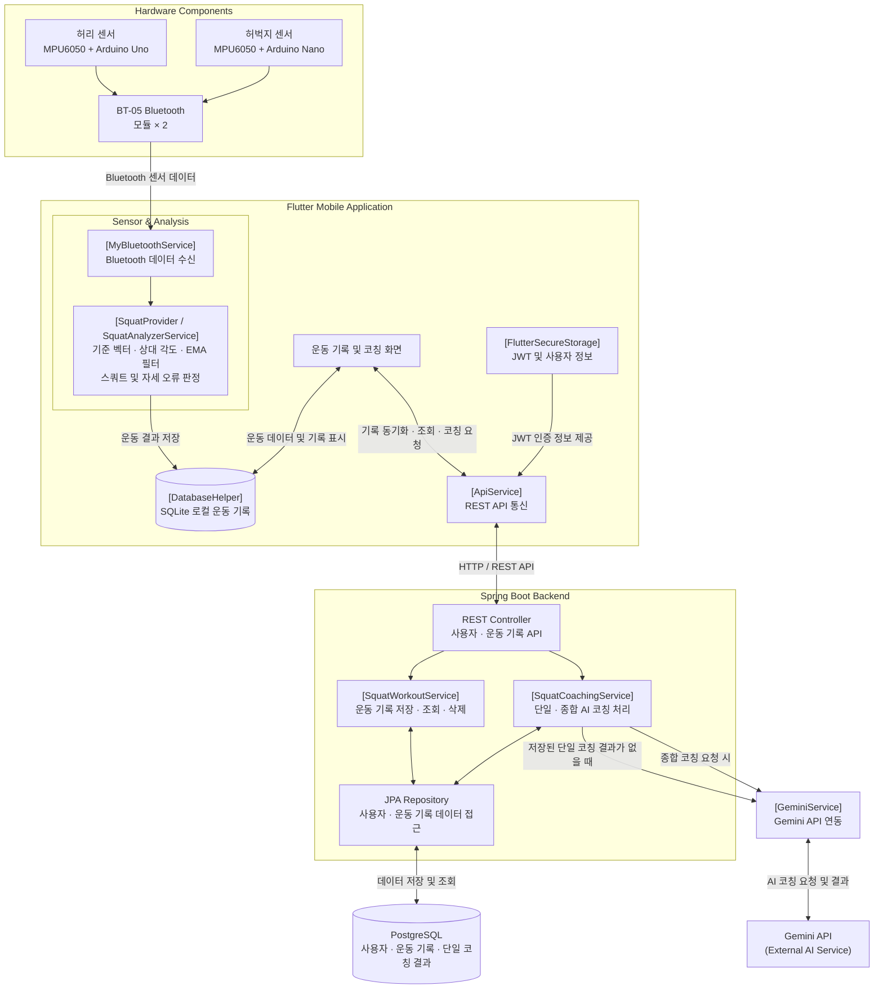

# SquatMate Architecture

## Component Diagram

시스템을 구성하는 주요 컴포넌트와 연결 관계입니다.

```mermaid
flowchart TB
    subgraph HW["Hardware Components"]
        direction LR
        S1["허리 센서<br/>MPU6050 + Arduino Uno"]
        S2["허벅지 센서<br/>MPU6050 + Arduino Nano"]
        BT["BT-05 Bluetooth<br/>모듈 × 2"]

        S1 --> BT
        S2 --> BT
    end

    subgraph APP["Flutter Mobile Application"]
        direction TB

        subgraph SENSOR["Sensor & Analysis"]
            direction LR
            BLE["[MyBluetoothService]<br/>Bluetooth 데이터 수신"]
            ANALYZER["[SquatProvider / SquatAnalyzerService]<br/>기준 벡터 · 상대 각도 · EMA 필터<br/>스쿼트 및 자세 오류 판정"]
            BLE --> ANALYZER
        end

        LOCAL[("[DatabaseHelper]<br/>SQLite 로컬 운동 기록")]
        UI["운동 기록 및 코칭 화면"]
        API_CLIENT["[ApiService]<br/>REST API 통신"]
        AUTH["[FlutterSecureStorage]<br/>JWT 및 사용자 정보"]

        ANALYZER -->|"운동 결과 저장"| LOCAL
        UI <-->|"운동 데이터 및 기록 표시"| LOCAL
        UI <-->|"기록 동기화 · 조회 · 코칭 요청"| API_CLIENT
        AUTH -->|"JWT 인증 정보 제공"| API_CLIENT
    end

    subgraph SERVER["Spring Boot Backend"]
        direction TB

        CONTROLLER["REST Controller<br/>사용자 · 운동 기록 API"]
        WORKOUT["[SquatWorkoutService]<br/>운동 기록 저장 · 조회 · 삭제"]
        COACHING["[SquatCoachingService]<br/>단일 · 종합 AI 코칭 처리"]
        REPOSITORY["JPA Repository<br/>사용자 · 운동 기록 데이터 접근"]

        CONTROLLER --> WORKOUT
        CONTROLLER --> COACHING
        WORKOUT <--> REPOSITORY
        COACHING <--> REPOSITORY
    end

    DB[("PostgreSQL<br/>사용자 · 운동 기록 · 단일 코칭 결과")]
    GEMINI["[GeminiService]<br/>Gemini API 연동"]

    BT -->|"Bluetooth 센서 데이터"| BLE
    API_CLIENT <-->|"HTTP / REST API"| CONTROLLER
    REPOSITORY <-->|"데이터 저장 및 조회"| DB

    COACHING -->|"저장된 단일 코칭 결과가 없을 때"| GEMINI
    COACHING -->|"종합 코칭 요청 시"| GEMINI
    GEMINI <-->|"AI 코칭 요청 및 결과"| EXT["Gemini API<br/>(External AI Service)"]
```
